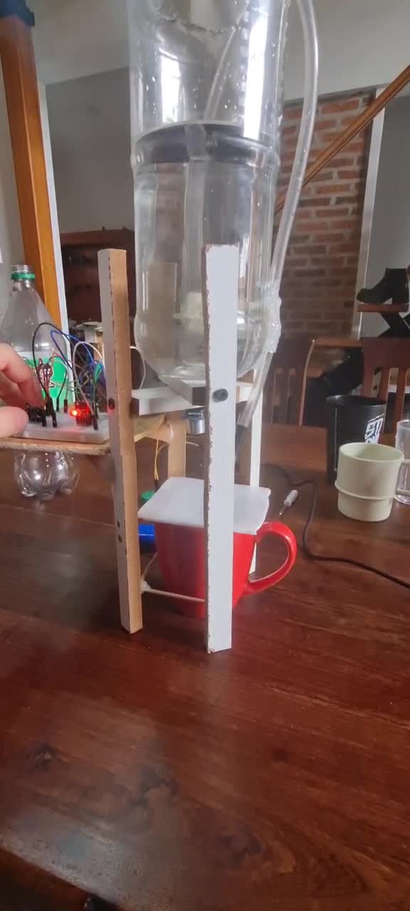
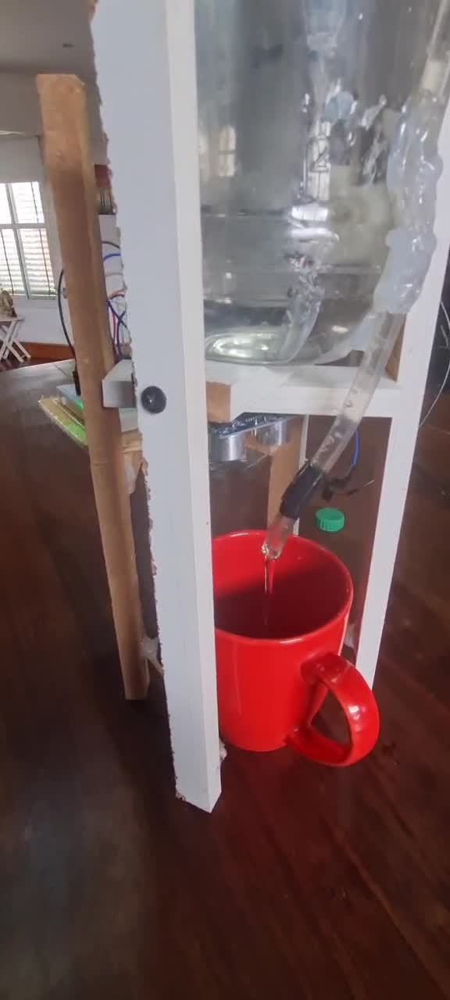
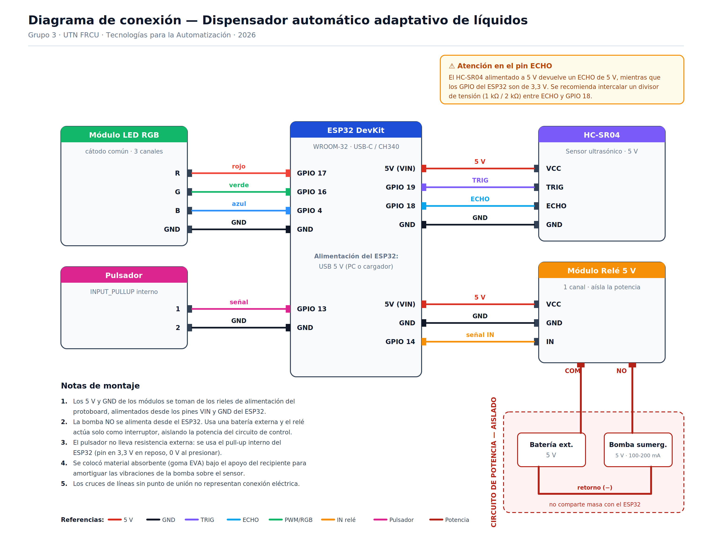

# 📌 UTN FRCU – Tecnologías para la Automatización ESP32 2026

**Adaptive automatic liquid dispenser**

---

## 👥 Team

- **Team number:** 3
- **Members:**
  - Araujo, Alejo
  - Castillo, Sebastián
  - Picos, Ghio
  - Lanzi, Gino

---

## 🤖 Project Description

### Description

An automatic dispenser that **adapts to whatever container is placed under it**. Before serving, the device uses an ultrasonic sensor to measure the height of the glass rim and then checks the bottom; using that reference, it works out how far it can fill and pours the liquid with a submersible pump, stopping the pump once it reaches a safe level just before overflowing.

Unlike a timed doser (which blindly pumps a fixed amount), this system **reads the actual liquid level throughout the whole filling process** and acts on that measurement, so it works the same with a short glass as with a tall mug, with no need to recalibrate.

| | |
|---|---|
|  |  |
| Complete assembly: reservoir on top, sensor under the shelf and electronics on the side. | Filling in progress with the LED in green. |

### Potential application

Self-service machines or food-service dispensers where containers are not always the same size. It can run unattended with no risk of overflow and no manual recalibration for glasses of different heights.

### Technology used

ESP32 (Espressif Arduino core), Arduino IDE 2.x, C++ / Arduino framework.

### Scope validation

The project scope was validated with the teaching staff in class on September 8, 2026.

---

## 🔩 Components Used

| Component | Quantity | Notes |
|---|---|---|
| ESP32 DevKit | 1 | ESP32-WROOM-32, USB-C connector, CH340 USB-to-serial bridge. Runs the state machine, processes the ultrasonic echoes and drives the actuators. 3.3 V logic. |
| HC-SR04 ultrasonic sensor | 1 | Measures distance by time of flight. 5 V supply, useful range 2–400 cm. Determines the position of the container's rim and bottom and the liquid level in real time. |
| Submersible water pump | 1 | 5 V DC hydraulic actuator, approximate draw 100–200 mA. Pushes the liquid from the reservoir to the glass. |
| 5 V relay module | 1 | 1 channel. Switching actuator that **isolates the control stage (ESP32) from the power stage (pump)**. Driven from GPIO 14. |
| RGB LED module | 1 | Visual status indicator, runs at 3.3 V with current-limiting resistors. Three independent channels (GPIO 17 / 16 / 4). |
| Push button | 1 | Trigger input on GPIO 13, configured with the internal `INPUT_PULLUP`: 3.3 V at rest, 0 V when pressed. No external resistor required. |
| 400-point breadboard | 1 | Solderless connection matrix, with power rails and rows of nodes. |
| Jumper wires (M-M, M-F, F-F) | ~15 | 2.54 mm DuPont terminals. Carry signal, power (5 V / 3.3 V) and ground between the ESP32, the modules and the breadboard. |
| External 5 V battery | 1 | **Powers only the pump**, through the relay, so the pump's current draw does not affect the sensor's supply. |
| Hose and reservoir | 1 | Inverted bottle used as the reservoir, with the outlet above the reservoir's maximum level. |
| EVA foam / foam | — | Absorbent material under the container's support, to dampen the pump's vibrations. |

---

## 🛠️ Usage Instructions

### 1. Set up the environment

1. Install the [Arduino IDE 2.x](https://www.arduino.cc/en/software).
2. Go to **File → Preferences → Additional boards manager URLs** and add:
   ```
   https://espressif.github.io/arduino-esp32/package_esp32_index.json
   ```
3. Open the **Boards Manager**, search for `esp32` and install **"esp32" by Espressif Systems**.
4. If the COM port does not show up when the board is connected, install the driver for the **CH340** USB-to-serial bridge and check that the USB cable is a data cable (not charge-only).

### 2. Configure the board

In the **Tools** menu:

| Option | Value |
|---|---|
| Board | **ESP32 Dev Module** |
| Port | the COM port that appears when the board is connected |
| Upload Speed | **115200** (higher values can interrupt the transfer on clone boards) |

### 3. Build the circuit



#### Pin map

| ESP32 pin | Connected to | Direction | Constant in the code |
|---|---|---|---|
| GPIO 19 | HC-SR04 – TRIG | Output | `PIN_TRIG` |
| GPIO 18 | HC-SR04 – ECHO | Input | `PIN_ECHO` |
| GPIO 14 | Relay module – IN | Output | `PIN_RELAY` |
| GPIO 13 | Push button | Input (`INPUT_PULLUP`) | `PIN_BOTON` |
| GPIO 17 | RGB LED – red channel | Output | `PIN_LED_R` |
| GPIO 16 | RGB LED – green channel | Output | `PIN_LED_G` |
| GPIO 4 | RGB LED – blue channel | Output | `PIN_LED_B` |
| VIN (5 V) | Breadboard + rail → HC-SR04 and relay module | — | — |
| GND | Breadboard − rail → all modules | — | — |

#### Critical points

- Connect the external battery **only** to the relay's power contacts (COM / NO), never to the breadboard.
- Mount the ultrasonic sensor facing down, fixed in place, above the container's position.
- **The hose outlet must sit above the reservoir's maximum level**, otherwise a siphon effect occurs.
- Place absorbent material under the container's support to isolate the pump's vibrations.

> **Important note on power:** the pump is **not** powered from the ESP32. The relay acts only as a switch, and the power circuit (battery + pump) is electrically isolated from the control circuit. This keeps the pump's current draw from causing voltage drops that make the sensor readings erratic (see *Challenges faced* in *Additional Notes*).

> **Note on the ECHO pin:** when powered at 5 V, the HC-SR04 returns a 5 V ECHO pulse, while the ESP32 GPIOs are 3.3 V. A voltage divider (1 kΩ / 2 kΩ) between ECHO and GPIO 18 is recommended so the pin is not driven above its rated voltage.

### 4. Calibrate

**This step is mandatory if the structure is modified.** The code contains two constants that depend on the physical geometry of the assembly:

```cpp
const float DISTANCIA_PISO = 17.5;
const float UMBRAL_VACIO   = 16;
```

Only `UMBRAL_VACIO` is used by the logic: it is **the distance in centimeters from the sensor to the base the container sits on**. The system uses it to detect that there is no glass: if the measurement is greater than or equal to that value, it assumes it is looking at the floor and aborts with an error.

The main sketch **does not print this distance** (with no container it only reports `ERROR: No hay vaso`, "no glass"), so to measure it you need to temporarily upload this auxiliary sketch, with the sensor already mounted in its final position and **no container on the base**:

```cpp
// Auxiliary calibration sketch: upload it, write down the value, then upload the main sketch again.
const int PIN_TRIG = 19;
const int PIN_ECHO = 18;

void setup() {
  Serial.begin(115200);
  pinMode(PIN_TRIG, OUTPUT);
  pinMode(PIN_ECHO, INPUT);
}

void loop() {
  digitalWrite(PIN_TRIG, LOW);  delayMicroseconds(2);
  digitalWrite(PIN_TRIG, HIGH); delayMicroseconds(10);
  digitalWrite(PIN_TRIG, LOW);
  long d = pulseIn(PIN_ECHO, HIGH, 30000);
  Serial.println(d == 0 ? -1.0 : (d * 0.0343) / 2.0);
  delay(500);
}
```

Write down the stable distance reported by the Serial Monitor and set that value (or 0.5 cm less) as `UMBRAL_VACIO` in the main sketch.

### 5. Upload and run

1. Open [`dispensador_automatico.ino`](dispensador_automatico.ino) in the Arduino IDE and press **Upload** (→).
2. If the console gets stuck on `Connecting......`, hold down the board's **BOOT** button until writing starts.
3. Open the **Serial Monitor** at **115200 baud**.

### 6. Usage sequence

1. **Red LED** → place the container on the base, **cover its mouth with your hand or a lid**, and press the push button.
2. The system waits 2 seconds and measures the distance to the cover: that is the glass rim. If it does not detect a container (distance ≥ `UMBRAL_VACIO`), it blinks red 4 times and returns to the start.
3. **Blue LED** → remove your hand or the lid. Once uncovered, the measured distance suddenly increases (the sensor now sees the bottom of the glass); when that jump exceeds 3 cm, the system waits 3 seconds for the reading to settle and measures the bottom.
4. **Green LED** → the pump fills the container while the sensor monitors the level, which gets closer and closer to the sensor.
5. When the safe level is reached, it stops and returns to the idle state (red).

### 7. Expected output

During a full cycle, the Serial Monitor shows the following (the firmware prints its messages in Spanish):

```
--- Dispensador Físico: Filtros Anti-Ruido Iniciados ---
Escaneando nivel de referencia...
Borde del vaso a: 11.24 cm.
Movimiento detectado. Esperando estabilización...
INICIANDO BOMBEO...
[EN VIVO] Distancia al sensor: 15.83 cm
[EN VIVO] Distancia al sensor: 14.21 cm
[EN VIVO] Distancia al sensor: 13.06 cm
[EN VIVO] Distancia al sensor: 12.68 cm
[EN VIVO] Distancia al sensor: 12.55 cm
[EN VIVO] Distancia al sensor: 12.41 cm
Nivel máximo alcanzado. Bombeo finalizado.
```

In this example the rim was measured at 11.24 cm, so the cut-off threshold is 11.24 + 1.5 = **12.74 cm**. Pumping only stops on the third consecutive reading below that value.

---

## 🧪 Simulation

**No Wokwi simulation was done.** The simulator has no model for a submersible water pump, which is the project's central actuator, so it was not possible to reproduce the full control loop (level measurement → pump actuation → change in the measured level). The system was developed and validated directly on the physical hardware.

---

## 📝 Additional Notes

### Challenges faced

#### 1. Siphon effect

**Problem.** In the first prototype, the hose outlet was **lower** than the liquid level in the reservoir. When the relay cut off the pump, the liquid **kept flowing due to gravity** (siphon effect) and overflowed the glass.

**Solution.** The hose was extended so that the outlet always discharges **above the reservoir's maximum level**. When the pump stops, the flow stops too.

#### 2. Voltage drop caused by the pump

**Problem.** With the pump and the sensor powered from the same ESP32 supply, the pump drew most of the available current and **the sensor no longer received enough power**. The HC-SR04 returned erratic values until it "froze" on a fixed reading (4.30 cm in the tests). Since that reading was below the cut-off threshold, the firmware stopped the pump after 1–2 seconds and the glass never filled.

**Solution.** The power stages were separated: the pump is now powered by an **external battery connected directly to the relay's power contacts**, bypassing the breadboard. An isolated anomalous reading still shows up occasionally, but the three-reading filters absorb it without causing false cut-offs.

#### 3. Mechanical vibrations transmitted to the sensor

**Problem.** The running pump made the whole structure vibrate, and that vibration reached the sensor. The receiving transducer picked it up and generated **very early spurious edges**, which were counted as echoes from an object a few centimeters away. The result was erratic, abnormally short readings during pumping.

**Solution.** Absorbent material (EVA foam / foam) was placed under the bottle's support, mechanically decoupling the structure from the sensor. The problem went away.

### Technical decisions

#### Finite state machine

The firmware is organized as a finite state machine with three states, declared with an `enum`:

| State | LED | What it does | How it exits |
|---|---|---|---|
| `ESPERANDO_VASO` | Solid red | Idle. Waits for the push button. When pressed, it waits 2 s and measures the distance to the **cover** over the container's mouth, storing it in `distanciaBorde`. | Moves to `ESPERANDO_RETIRO_TAPA` if it detected a valid container. If `distanciaBorde >= UMBRAL_VACIO`, it blinks red 4 times and stays idle. |
| `ESPERANDO_RETIRO_TAPA` | Solid blue | Waits for the reading to exceed `distanciaBorde + 3 cm`, which happens when the glass is uncovered and the bottom becomes visible. It then waits 3 s for the reading to settle and measures the bottom. | Moves to `LLENANDO` and closes the relay. If the bottom reads `>= UMBRAL_VACIO`, it assumes the glass was removed, flags an error and returns to the start. |
| `LLENANDO` | Solid green | Relay closed, pump running. Prints the live distance and checks the cut-off conditions on every iteration. | Once the cut-off is confirmed, it opens the relay and returns to `ESPERANDO_VASO`. |

#### Distance measurement

```cpp
float medirDistancia() {
  digitalWrite(PIN_TRIG, LOW);
  delayMicroseconds(2);
  digitalWrite(PIN_TRIG, HIGH);
  delayMicroseconds(10);      // 10 us trigger pulse
  digitalWrite(PIN_TRIG, LOW);

  long duracion = pulseIn(PIN_ECHO, HIGH, 30000);  // 30 ms timeout
  if (duracion == 0) return 999.0;                 // no echo -> sentinel value
  return (duracion * 0.0343) / 2.0;
}
```

The sensor emits an ultrasonic burst when it receives a 10 µs pulse on TRIG, and holds ECHO high for the sound's time of flight. `pulseIn()` measures that time in microseconds; multiplying by 0.0343 cm/µs (the speed of sound) and dividing by two (there and back) gives the distance.

The 30 ms `timeout` keeps the program from blocking if no echo comes back. In that case the function returns **999.0 as a sentinel value**, which the rest of the logic treats as "out of range".

#### Anti-noise filters

This is the most important part of the control, and it responds directly to the disturbances observed in practice. No cut-off condition acts on a single reading: **three consecutive readings are required** to confirm the condition.

```cpp
// Filter 1: maximum level reached
if (distanciaActual <= (distanciaBorde + 1.5)) {
  lecturasCorte++;
  if (lecturasCorte >= 3) { digitalWrite(PIN_RELAY, LOW); /* ... */ }
} else {
  lecturasCorte = 0;   // false positive: reset the counter
}
```

- **Filter 1 — maximum level:** cuts off when the liquid reaches 1.5 cm below the rim, leaving a safety margin against overflow.
- **Filter 2 — critical overshoot:** emergency cut-off if the surface rises above the rim height.

The counter resets on any reading that contradicts the condition, so an isolated measurement caused by ripples or a vibration does not trigger the cut-off. The `delay(100)` at the end of `loop()` sets the sampling rate at about **10 readings per second**, so confirming three readings takes roughly 0.3 s.

> **Actual behavior of the two filters.** Filter 2's condition (`distanciaActual < distanciaBorde`) is **contained** within Filter 1's (`distanciaActual <= distanciaBorde + 1.5`): every reading that triggers Filter 2 also increments Filter 1's counter. As a result, in the current implementation Filter 1 always reaches its 3 confirmations in the same iteration as Filter 2 or earlier, and since the two `if` blocks are independent (there is no `else if` or `break` between them), on an overshoot both run in the same pass: both messages are printed and two `delay(2000)` calls are chained, blocking for 4 seconds. The cut-off still happens safely —the relay opens— but in practice Filter 2 is not an independent cut-off path.

#### Configurable parameters

| Constant | Value | Meaning |
|---|---|---|
| `UMBRAL_VACIO` | `16` | Sensor-to-base distance in cm. **Depends on the physical assembly: recalibrate if the sensor is moved.** |
| `DISTANCIA_PISO` | `17.5` | Declared but not used by the program. |
| Cut-off margin | `+1.5` cm | Safety distance from the rim at which pumping is stopped. |
| Removal threshold | `+3.0` cm | Minimum change interpreted as the hand or lid being removed. |
| Confirmation readings | `3` | Number of consecutive measurements required to validate a cut-off. |
| Sampling period | `100` ms | `delay()` at the end of `loop()`. |

### Current limitations

- **The system depends on a manual step by the operator.** The container's mouth must be covered before pressing the button. If this is skipped, the system gets stuck in the blue state without signaling the error.
- **Calibration is manual and depends on the geometry.** `UMBRAL_VACIO` is set to 16 cm for this specific structure; any change in the sensor's height requires recalibrating before using the system.
- **Filter 2 is not an independent cut-off path.** Its condition is contained within Filter 1's (see *Anti-noise filters*); on an overshoot both blocks run and the system blocks for 4 s instead of 2 s.
- **`distanciaFondo` is measured but does not take part in the cut-off calculation.** It is used only as a safety check, to confirm the container is still present; the cut-off decision is based solely on `distanciaBorde`.
- **`DISTANCIA_PISO` is declared but never used** in the body of the program: `UMBRAL_VACIO` fills that role.
- **`ultimaDistanciaReportada` is assigned but never read.** It is a leftover variable with no effect on behavior.
- **Sensor dead zone.** The HC-SR04 cannot measure below 2 cm, so very tall containers that bring the liquid surface that close to the sensor are out of range.
- **Blocking wait on the push button.** While the button is held down, the debounce `while` loop blocks `loop()`; during that time the system does not respond to any other condition.
- **Waits use `delay()`.** The 2 s and 3 s settling waits halt execution completely, including sensor readings.

### Potential improvements

We propose implementing a dynamic filling feature in which the user can set the desired fill level by pressing one of four push buttons, to be added by the next team. Each button could represent a fixed value, for example 25%, 50%, 75% and 100%. Knowing the container's maximum capacity or total depth, the system would automatically calculate the equivalent level and fill the glass exactly up to that mark.
