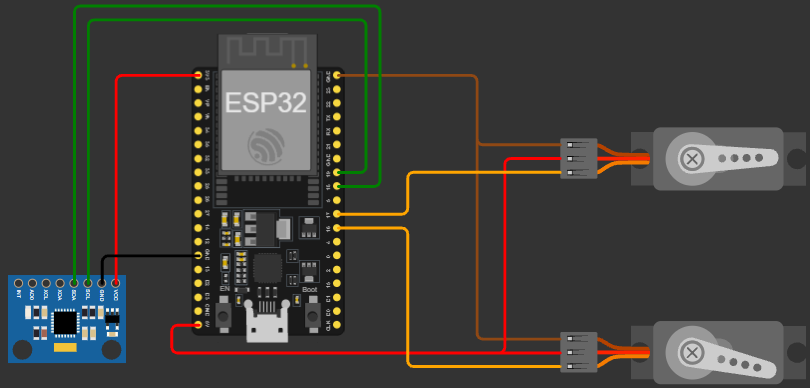

# 📌 UTN FRCU – Tecnologías para la Automatización ESP32 2026

## 👥 Team

**Team number:** 8

**Members:**
- Isaias Muga
- Santiago Poerio
- Franco Riolfo
- Federico Rojas
- Diego Venturino

## 🤖 Project Description

**Description:** A 2-axis phone stabilizer (gimbal) that corrects unwanted movement in Roll (X) and Pitch (Y). An ESP32 reads the accelerometer and gyroscope of an MPU6050 sensor, estimates the tilt by combining both sensors (complementary filter), and drives two servo motors in the opposite direction of the tilt, so the phone holder stays level even when the hand moves. The project shows that basic two-axis stabilization can be achieved with cheap, easy-to-find components.

**Technology used:** ESP32, Arduino IDE 2.x (`esp32` board package 3.3.12), MPU6050 inertial sensor, MG90S servo motors, Adafruit MPU6050 2.2.9, Adafruit Unified Sensor 1.1.15, Adafruit BusIO 1.17.4 and ESP32Servo 3.2.1 libraries, Wokwi simulation, 3D-printed parts.

## 🔩 Components Used

| Component | Quantity | Notes |
|---|---|---|
| ESP32 DevKit | 1 | Selected as "ESP32 Dev Module" in Arduino IDE. 3.3 V logic |
| MPU6050 (GY-521 module) | 1 | 3-axis accelerometer + 3-axis gyroscope, I2C communication (address 0x68) |
| MG90S servo motor | 2 | One for Roll (X axis) and one for Pitch (Y axis). 4.8 to 6 V supply |
| 3D-printed parts | 1 set | Handle and phone holder structure |
| Breadboard / Jumper wires | 1 / as needed | The breadboard distributes connections and joins the common GND |
| Power supply | 2 | ESP32: computer USB port (5 V). Servos: separate USB cable with one end cut off (only 5 V and GND kept), plugged into another USB port or a 5 V wall charger (1 A or more recommended) |

## 🛠️ Usage Instructions

### Step 1: Install and configure the software
1. Install the [Arduino IDE 2.x](https://www.arduino.cc/en/software).
2. In *File > Preferences*, add this URL to "Additional boards manager URLs":
   `https://espressif.github.io/arduino-esp32/package_esp32_index.json`
3. In *Tools > Board > Boards Manager*, install the **esp32** package by Espressif Systems.
4. In *Tools > Manage Libraries*, install **Adafruit MPU6050** (accept its dependencies: Adafruit Unified Sensor and Adafruit BusIO) and **ESP32Servo** (by Kevin Harrington). `Wire` is already included in the esp32 package.

### Step 2: Wiring / circuit setup

| Component | Component pin | Connects to |
|---|---|---|
| MPU6050 | VCC | ESP32 3.3 V |
| MPU6050 | GND | Common GND |
| MPU6050 | SDA | ESP32 GPIO 18 |
| MPU6050 | SCL | ESP32 GPIO 19 |
| Servo X (Roll) | Signal (orange) | ESP32 GPIO 16 |
| Servo X (Roll) | Positive (red) | 5 V from the servos' USB cable |
| Servo X (Roll) | Negative (brown) | Common GND |
| Servo Y (Pitch) | Signal (orange) | ESP32 GPIO 17 |
| Servo Y (Pitch) | Positive (red) | 5 V from the servos' USB cable |
| Servo Y (Pitch) | Negative (brown) | Common GND |
| Servos' USB cable | Negative | Common GND (breadboard negative rail) |
| ESP32 | GND | Common GND |
| ESP32 | USB | Computer (powers the board and uploads the program) |

### Step 3: Upload and run the sketch
1. Connect the ESP32 via USB. In *Tools*, select the **ESP32 Dev Module** board and the corresponding port.
2. Open the `.ino` file and upload the code. If the upload does not start, hold down the **BOOT** button on the board until it begins.
3. Connect the servos' power cable to another USB port or to a 5 V wall charger.
4. Open the **Serial Monitor at 115200 baud**.
5. Keep the gimbal **still and level** while the monitor shows "CALIBRANDO GIROSCOPIO" (it takes 500 samples, a few seconds). If it moves during calibration, the servos will drift on their own: reset the board with the **EN** button and repeat.

### Step 4: Expected output
- On power-up, the servos move to their center position (`CENTRO_SERVO_X = 104°`, `CENTRO_SERVO_Y = 134°`).
- The gyroscope is then calibrated and the system starts compensating for tilt: when the handle is tilted, the phone holder stays level.
- Once per second, the Serial Monitor shows the accelerometer angle, the gyroscope rate, the estimated angle and the position of each servo. Example (values are illustrative):

```
-----------------------------
Acelerometro X: 0.52° | Y: -0.31°
Gyro X: 0.02 °/s | Gyro Y: -0.05 °/s
Angulo estimado X: 0.48° | Y: -0.30°
Servo X: 104° | Servo Y: 134°
```

### Adjustable parameters

| Parameter | Value | What it controls |
|---|---|---|
| `UMBRAL_GYRO` | 1.0 °/s | Rotation rate below which the sensor is considered still |
| `TIEMPO_ESPERA` | 500 ms | Time the sensor must stay still before drift correction starts |
| `CORRECCION_DERIVA` | 0.02 | Weight of the accelerometer in each correction (higher corrects drift faster but adds noise) |
| `KI` | 0.15 | Integral gain: how fast the correction is applied each cycle (higher reacts faster but may oscillate) |
| `ZONA_MUERTA` | 0.5° | Errors smaller than this are ignored to avoid jitter |
| `LIMITE_DELTA` | 85° | Maximum compensation allowed from the center (protects the mechanism) |
| `LIMITE_PITCH_CORR` | 50° | Above this pitch, roll is not corrected with the accelerometer |
| `CENTRO_SERVO_X/Y` | 104° / 134° | Level position of each servo. They depend on the physical assembly and must be readjusted if the structure is rebuilt |

### How it works (summary)
- **Gyroscope:** measures rotation rate (°/s). It is accurate for fast movements, but integrating it accumulates error (drift).
- **Accelerometer:** measures gravity and gives an absolute angle with no drift, but it is noisy under vibration.
- **Complementary filter:** while there is movement, the gyroscope is used; when the sensor is still, the estimated angle slowly moves toward the accelerometer angle to correct drift.
- **Integral control:** each cycle, a fraction of the estimated angle (`KI × error`) is added to each servo's accumulated compensation until the error reaches 0 (level position).

*(Add screenshots of the Serial Monitor and photos of the assembled prototype here.)*

## 🧪 Simulation

The circuit was simulated in Wokwi while the parts were being printed, so that once they arrived only the physical assembly was left.

**Wokwi project link:** [Estabilizador_Celular_GRUPO_8](https://wokwi.com/projects/477088166542319617)

**Diagram/export files:** 

## 📝 Additional Notes

**Challenges faced / technical decisions made:**
- **Gyroscope drift:** integrating the rotation rate accumulated small errors, and one of the servos ended up tilted even though the holder had not moved. It was solved with a calibration at startup (`calibrarGyro()`, which measures and subtracts the gyroscope's fixed error) and a gradual drift correction that uses the accelerometer as a reference when the system is still.
- **3D-printed parts fit:** there were differences between the 3D model dimensions and the printed parts. The dimensions were adjusted and the parts were reprinted (about one day).
- **Printing times:** the parts were printed by a person outside the group. Meanwhile, work continued on the code and the Wokwi simulation.
- **Separate servo power supply:** to prevent consumption peaks from resetting the ESP32, with a common GND between all components.
- **Dead zone and limits:** a dead zone (0.5°) and a compensation limit were added to avoid jitter and protect the mechanism.

**Current limitations:**
- The system takes the position it starts in as 0°, so it must be powered on level and kept still during calibration.
- The MG90S servos have limited torque (about 1.8 kg·cm at 4.8 V) and a USB port delivers about 500 mA: with a heavy phone the servos may shake or lose strength (a wall charger of 1 A or more is recommended).
- The servo center values depend on the physical assembly.

**Potential improvements:**
- Manual control mode with an analog joystick: pressing the button (with an interrupt and debouncing) stops stabilization, the servos go to their center position and the user moves the camera with the stick. Pressing it again resumes stabilization.
- Upgrade from integral control to a full PI or PID controller.
- Add a third servo for the Yaw axis, with a magnetometer to correct its drift.
- Add a capacitor to the servo power supply to absorb consumption peaks.
